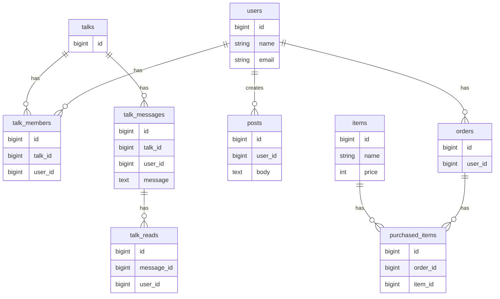

# 🎤 Shining Will Fanclub

地下アイドル・アーティスト向けの会員制ファンクラブシステムです。

Laravel 11 を用いて開発し、

* 会員管理
* DM機能
* 投稿機能
* EC機能
* デジタル会員証
* 権限管理
* 管理画面

など、実運用を想定した機能を実装しています。

単なるCRUDアプリではなく、

「複数ロールを持つユーザーが継続的に利用するサービス」

をテーマに、

* 権限管理
* メッセージ機能
* 未読管理
* イベント駆動設計
* 保守性を意識した責務分離

を重視して設計しました。

---

# ✅ このプロジェクトで証明できること

* Laravelを用いた実務レベルのバックエンド開発
* 権限管理を考慮したシステム設計
* Event + Listenerを利用したイベント駆動設計
* DM機能・未読管理など状態管理を伴う実装
* N+1問題を考慮したパフォーマンス改善
* Filamentによる管理画面構築
* Docker + VPSによるサーバー構築・公開
* Linux / Nginx / MySQL を用いた運用経験

---

# 🎯 開発背景

地下アイドルやアーティスト向けのファンクラブサービスでは、

* 会員限定コンテンツ
* タレントとファンの交流
* グッズ販売
* 購入履歴管理
* 管理者による運営

など、多くの機能が必要になります。

また、

* 管理者
* タレント
* 一般会員

で利用できる機能が異なるため、

複数ロールを持つユーザー管理と権限制御が重要になります。

本プロジェクトでは、

「会員制コミュニティサービス」

をテーマとして、

実際の運用を意識したファンクラブシステムを構築しました。

---

# 🏗 システム構成

```text
Internet
    ↓
Nginx
    ↓
Laravel 11
    ↓
MySQL
```

---

# 🛠 技術スタック

| 分類              | 技術                 |
| --------------- | ------------------ |
| Language        | PHP 8.3            |
| Framework       | Laravel 11         |
| Admin           | Filament v3        |
| Frontend        | Blade / JavaScript |
| Database        | MySQL              |
| Authentication  | Laravel Auth       |
| Permission      | Spatie Permission  |
| Server          | Ubuntu             |
| Web Server      | Nginx              |
| Container       | Docker             |
| Version Control | Git / GitHub       |
| Infrastructure  | ConoHa VPS         |

---

# ⭐ 主な機能

### 会員機能

* ホーム
* 投稿閲覧
* DM機能
* 未読管理
* 購入履歴
* デジタル会員証

### タレント機能

* 投稿作成
* DM返信

### 管理者機能

* 投稿管理
* 商品管理
* タレント管理
* トーク管理
* 会員管理
* BAN管理
* システム設定

# 🧠 コア設計

本プロジェクトでは、

「会員」「タレント」「管理者」

という複数ロールを持つユーザーが共存する会員制サービスを想定し、

* 権限管理
* DM機能
* 未読管理
* イベント駆動設計

を中心に設計を行いました。

---

## 権限管理

以下の3つのロールを持ちます。

```text
admin
↓
運営管理者

talent
↓
タレント

user
↓
一般会員
```

利用できる機能をロールごとに制御しています。

| Role   | 利用可能機能       |
| ------ | ------------ |
| admin  | 全機能          |
| talent | 投稿・DM返信      |
| user   | 投稿閲覧・DM・ショップ |

Spatie Permission を利用し、

認可処理を一元管理しています。

---

## Event + Listener によるDMルーム自動生成

ユーザー登録時に、

Event + Listener を利用して

DMルームを自動生成しています。

```text
ユーザー登録
↓
UserRegistered Event
↓
CreateTalkListener
↓
Talk生成
↓
TalkMember生成
```

自動生成される内容

```text
Talk

Shining × 山田太郎
```

参加者

* タレント
* ユーザー

を自動登録しています。

イベント駆動にすることで、

Controllerに処理を集中させず、

責務分離を意識した構成としています。

---

## 未読管理

DMの既読状態は

talk_reads

テーブルで管理しています。

```text
Talk
↓
TalkMessage
↓
TalkRead
```

メッセージごとに既読状態を保持することで、

* 未読件数表示
* 既読判定

を実現しています。

---

## 表示名生成

Talkモデルに

```php
getDisplayNameForUserAttribute()
```

を実装しています。

### 一般ユーザー画面

```text
Shining
```

### 管理画面

```text
Shining × 山田太郎
```

利用者によって表示名を変更することで、

UI側の責務を減らし、

Model側へロジックを集約しています。

---

## N+1問題対策

DM一覧など、

関連データ取得が多い箇所では

Eager Loading を利用しています。

```php
Talk::with([
    'members.user',
    'latestMessage'
])->get();
```

不要なSQL発行を防ぎ、

パフォーマンス向上を意識しています。

# 👨‍💻 工夫したポイント

本プロジェクトでは、単なるCRUDアプリではなく、

「複数ロールを持つユーザーが継続的に利用する会員制サービス」

をテーマに、

保守性・拡張性を意識した設計を行いました。

---

## ① Spatie Permissionによる権限管理

会員制サービスでは、

* 管理者
* タレント
* 一般会員

で利用できる機能が異なります。

本システムでは、

```text
admin
talent
user
```

の3つのロールを定義し、

Spatie Permissionを利用して権限管理を実装しました。

利用者ごとにアクセス可能な機能を分離することで、

保守性と拡張性を意識した構成としています。

---

## ② Event + ListenerによるDMルーム自動生成

ユーザー登録時に、

Event + Listener を利用して、

タレントとのDMルームを自動生成しています。

```text
ユーザー登録
↓
UserRegistered Event
↓
CreateTalkListener
↓
Talk生成
↓
TalkMember生成
```

自動生成される内容

* Talk
* TalkMember

参加者

* タレント
* ユーザー

Controllerに処理を集中させず、

イベント駆動による責務分離を意識しました。

---

## ③ Eager LoadingによるN+1問題対策

DM一覧画面など、

関連データ取得が多い箇所では、

Eager Loadingを利用しています。

```php
Talk::with([
    'members.user',
    'latestMessage'
])->get();
```

不要なSQL発行を抑えることで、

パフォーマンス向上を意識しました。

---

## ④ Accessorを利用した表示名生成

Talkモデルに

```php
getDisplayNameForUserAttribute()
```

を実装しています。

一般ユーザー画面

```text
Shining
```

管理画面

```text
Shining × 山田太郎
```

利用者によって表示内容を切り替えることで、

View側の責務を減らし、

Modelへロジックを集約しています。

---

## ⑤ 未読管理

既読情報は

talk_reads

テーブルで管理しています。

```text
Talk
↓
TalkMessage
↓
TalkRead
```

これにより、

* 未読件数表示
* 既読判定
* 最新メッセージ取得

などを実現しています。

状態管理を独立させることで、

将来的な機能追加にも対応しやすい構成としています。

---

## ⑥ 責務分離を意識した設計

以下の責務を意識して実装しています。

```text
Controller
↓
Service
↓
Model
↓
Repository
```

### Controller

リクエスト受付とレスポンス返却のみを担当。

### Service

業務処理を担当。

* DM作成
* 投稿処理
* 会員証生成

などを実装。

### Model

ドメインロジックを保持。

### Repository

データアクセス処理を担当。

責務を分離することで、

* 保守性
* 拡張性
* テスト容易性

を意識した構成としています。

---

## ⑦ Docker + VPSによる公開環境構築

アプリケーション開発だけでなく、

サーバー構築から公開まで一貫して担当しました。

構成

```text
Ubuntu
Nginx
PHP8.3
MySQL8
Docker
```

担当内容

* Docker環境構築
* Nginx設定
* Laravelデプロイ
* ドメイン設定
* HTTPS化
* 公開環境構築

開発だけでなく、

運用を意識した環境構築も経験しています。

---

単なるCRUDアプリではなく、

「複数ユーザーが継続的に利用する会員制サービス」

を意識し、

権限管理・イベント駆動設計・状態管理・責務分離を重視して開発しました。

# 📊 ER図

本システムでは、

* 会員
* タレント
* DM
* 投稿
* ショップ

を中心にデータを管理しています。



---

# 🚀 サーバー構築

個人で VPS を契約し、

Linux サーバー上で公開環境を構築しました。

## サーバー構成

```text
Ubuntu
Nginx
PHP8.3
MySQL8
Docker
```

## サーバースペック

```text
CPU 2 Core

Memory 1GB
```

## 担当内容

* Docker環境構築
* Laravelデプロイ
* Nginx設定
* ドメイン設定
* HTTPS化
* 公開環境構築

開発だけでなく、

インフラ構築から公開まで一貫して担当しました。

---

# 📂 ディレクトリ構成

```text
app
 ├ Models
 ├ Services
 ├ Events
 ├ Listeners
 ├ Http
 │   ├ Controllers
 │   └ Requests
 └ Providers

resources
 ├ views
 ├ members
 ├ admin
 └ components

routes
 ├ web.php
 ├ admin.php
 └ members.php
```

責務ごとにディレクトリを分離し、

保守性を意識した構成としています。

---

# 🚧 現在の実装状況

| 機能      | 状態 |
| ------- | -- |
| 会員管理    | ✅  |
| DM機能    | ✅  |
| 未読管理    | ✅  |
| 投稿機能    | ✅  |
| 権限管理    | ✅  |
| ショップ機能  | ✅  |
| 購入履歴    | ✅  |
| デジタル会員証 | ✅  |
| 管理画面    | ✅  |
| BAN管理   | ✅  |
| Push通知  | 🚧 |
| サブスク管理  | 🚧 |
| 画像送信    | 🚧 |
| PWA化    | 🚧 |
| iOSアプリ化 | 🚧 |

---

# 🔥 今後追加予定

* Stripe決済

* サブスク管理

* Push通知

* トーク画像送信

* スタンプ機能

* 背景着せ替え

* PWA化

* iOSアプリ化

* Firebase通知

* AWS移行

  * S3
  * CloudFront
  * RDS

* GitHub ActionsによるCI/CD

---

# 📝 まとめ

本プロジェクトでは、

* 権限管理
* DM機能
* 未読管理
* 投稿機能
* ショップ機能
* デジタル会員証

など、

複数ユーザーが継続的に利用する会員制サービスを想定して開発を行いました。

単なるCRUDアプリではなく、

* Event + Listenerによるイベント駆動設計
* Spatie Permissionによる権限制御
* Eager LoadingによるN+1問題対策
* Accessorを利用した表示ロジックの集約
* 責務分離を意識した設計

を重視しています。

また、

* Laravel
* Filament
* Docker
* Linux
* Nginx
* MySQL
* VPS公開

まで一貫して担当し、

開発から運用までを経験しました。

今後は、

サブスク機能やPush通知などを追加し、

継続的に機能拡張を行っていく予定です。

🙏 ご覧いただきありがとうございました。
